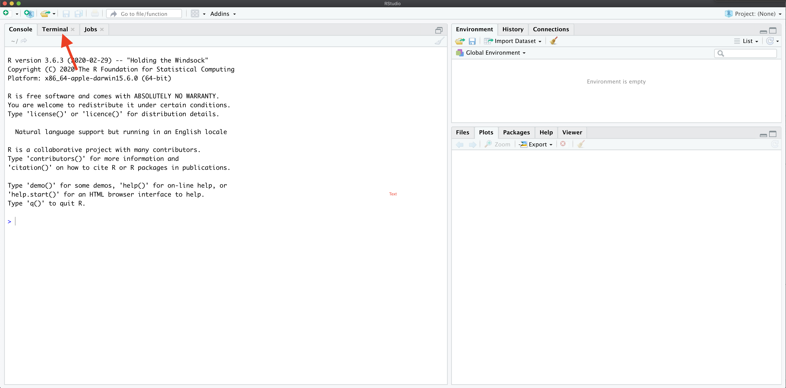
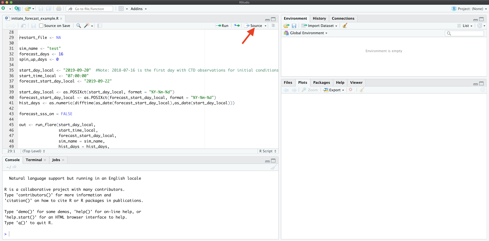
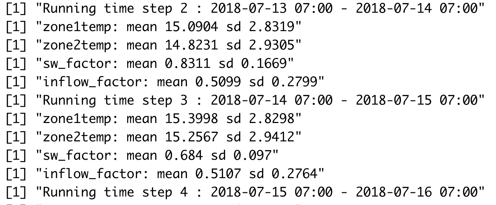

```{r setup, include=FALSE}
knitr::opts_chunk$set(echo = TRUE)
library(tidyverse)
library(ncdf4)
library(lubridate)
```

## Requirements
* R Studio

## Step 1: Set up

To set up the files needed for FLARE perform either Step 1a or Step 1b

* Step 1a is the quickest way to get FLARE set-up but won't have the most 
  recent data or code.
* Step 1b is required if you want to automatically pull new data from GitHub

### Step 1a: Pre-packaged code and data

Download and unzip the file here:

`https://www.dropbox.com/s/k6sue0855lox7px/flare_testing_files.zip?dl=0`

### Step 1b: Generating directories, downloading code, and downloading data manually 

**Download FLARE code**

* Open R Studio

* Locate the terminal tab

{width=75%}

* In the terminal, create the location on your computer where you want to save 
  files for the tutorial.  

  `mkdir /Users/quinn/Dropbox/Research/SSC_forecasting/flare_training`   
  
  This will be called your tutorial directory below
  
* In the terminal, move to the new directory

  `cd /Users/quinn/Dropbox/Research/SSC_forecasting/flare_training` 

* In the terminal tab run the following command to download the FLARE code from
  Github
  
  `git clone https://github.com/CareyLabVT/FLARE.git`
  
  You should see a new folder named `FLARE` in your working directory
  
**Download data**

* In the terminal tab run the following command to create a new directory for 
  data used by FLARE in the tutorial directory
  
  `cd /Users/quinn/Dropbox/Research/SSC_forecasting/flare_training`
  
  `mkdir SCC_data`

* In the terminal change your directory to this new data directory

  `cd /Users/quinn/Dropbox (VTFRS)/Research/SSC_forecasting/flare_training/SCC_data`

* Download the met station data by running the following command in the terminal

  `git clone -b carina-data --single-branch https://github.com/CareyLabVT/SCCData.git carina-data`

* Download the catwalk data by running the following command in the terminal

  `git clone -b mia-data --single-branch https://github.com/CareyLabVT/SCCData.git mia-data`

* Download the weir data by running the following command in the terminal

  `git clone -b diana-data --single-branch https://github.com/CareyLabVT/SCCData.git diana-data`

* Download non-sensor data by running the following command in the terminal

  `git clone -b manual-data --single-branch https://github.com/CareyLabVT/SCCData.git manual-data`

  The non-sensor data include
    * CTD data from EDI
    * SSS files
    * Nutrient chemistry from EDI
    * Weir data from EDI
    
* Download the met station from EDI (this file is too big for Github so you
  have to get it directory from EDI)
  
  * The file can be found at:
  https://portal.edirepository.org/nis/mapbrowse?packageid=edi.389.4
  * Download `Met_final_2015_2019.csv` and move it to your `SCC_data/manual-data`
  directory
  * Alternatively you can use R to download from EDI using the following command
  
```{r eval = FALSE}
download.file("https://portal.edirepository.org/nis/dataviewer?packageid=edi.389.4&entityid=c1db8816742823eba86696b29f106d0f",
              destfile = "SCC_data/Met_final_2015_2019.csv")
```

**Create directory for running FLARE**

* Create a directory in your working directory (not the SCC_data directory) by 
running the following command in your terminal

  `mkdir /Users/quinn/Dropbox/Research/SSC_forecasting/flare_training/flare_test_sim`

 Copy the following files from `FLARE/example_configuration_files` to 
`flare_test_sim`

 * `initiate_forecast_example.R`
 * `glm3_woAED.nml`
 * `configure_FLARE.R`
 
## Step 2: Configure simulation

A FLARE simulation with AED requires three files that should be in your 
`flare_test_sim` directory.  The configuration are spread across the files

 * `initiate_forecast_example.R`
 * `glm3_woAED.nml`
 * `configure_FLARE.R`
 
### glm3_woAED.nml

`glm3_woAED.nml` is already configured for FCR.

### initiate_forecast_example.R

This file is the main script that launches the FLARE code and plots the output.
In this file you will modify the following variables

* `data_location`: This is the `SCC_data` directory (full path)
* `code_folder`: This is the `FLARE` directory (full path)
* `forecast_location`: This is the `flare_test_sim` directory  (full path)
* `execute_location`: This is the same as `forecast_location` unless you are
  executing the simulation in a different directory.  I use this to execute the
  code on a ramdisk to save read-writes to my harddisk.  You don't need to do 
  this in the tutorial
* `restart_file`: This is the full path to the file that you want to use as
  initial conditions for the simulation.  You will set this to `NA` simulation
  is not a continuation of a previous simulation.
* `sim_name`: a string with the name of your simulation.  This will in your 
  output file names
* `forecast_days`: This is your forecast horizon. The max is `16` days.  Set to `0`
  if only doing data assimilation with observed drivers.
* `spin_up_days`: set to zero.  Don't worry about this one.
* `start_day_local`: The date that your simulation starts.  Uses the YYYY-MM-DD
   format "2019-09-20".  `2018-07-12` is the first day in the SCC project (when
   the catwalk temperature data comes online)
* `start_time_local`: The time of day you want to start a forecast.  Because GLM
  is a daily timestep model, the day it simulation will start at this time. It 
  uses `mm:hh:ss` format and must only be a whole hour.  It is in the **local time
  zone** of the lake in standard time.  It can be any hour if only doing data 
  assimilation with observed drivers (forecast_days = 0). If forecasting 
  (forecast_days > 0) it is required to match up with the availability of a NOAA 
  forecast. NOAA forecasts are available at 
  * 00:00:00 GMT
  * 06:00:00 GMT
  * 12:00:00 GMT
  * 18:00:00 GMT
* `forecast_start_day_local`: The date that you want forecasting to start in 
   your simulation.  Uses the YYYY-MM-DD format "2019-09-20".  The difference
   between `start_time_local` and `forecast_start_day_local` determines how 
   many days of data assimilation occur using observed drivers before handing 
   off to forecasted drivers and not assimilating data
* `forecast_sss_on`: Only used in AED simulations for setting the SSS to on in
  the forecast

`initiate_forecast_example.R` loads Rscripts and runs the flare code with
the EnKF `run_flare` and the plotting code `plot_forecast`.

### configure_FLARE.R

`configure_FLARE.R` has the bulk of the configurations for FLARE that you will
set once and reuse (unlike `initiate_forecast_example.R` which changes when
you want to forecast a new time period). The end of this document describes all 
of the configurations in `configure_FLARE.R`.  Later in the tutorial, you will
modify key configurations in `configure_FLARE.R`

If you set up your directories and modified the 
`initiate_forecast_example.R` as described above, then you will not need to 
modify `configure_FLARE.R` to do a test simulation.

## Step 3: Run your first simulation

To run your first FLARE simulation confirm that the following variables are set 
in your `initiate_forecast_example.R` file:

* `restart_file <- NA`
* `sim_name <- "test"`
* `forecast_days <- 16`
* `start_day_local <- "2018-07-12"`  
* `start_time_local <- "07:00:00"`
* `forecast_start_day_local <- "2018-10-16"`

Now source `initiate_forecast_example.R`.

{width=75%}

You will find that a `working_directory` directory is created in your 
`flare_test_sim` directory.  This is were all the files for the simulation are 
stored. After the simulation is finished all the important files are moved to 
the `flare_test_sim` directory so it is fine to delete the `working_directory`.

Your console will show a lot of messages from R that are mostly associated with
reading and writing files.  You will know that you simulation has started to 
work when you see the timestep being printed out to the console.

{width=50%}

Once the simulation is complete you will find a PDF and a netcdf (.nc) file in 
`flare_test_sim` directory.  The PDF is the plotted output and the netcdf file
is the flare output.

## Step 3: Examining FLARE output

First, you can view the PDF that is output automatically.  The PDF includes
the mean and 95% CI for all depths simulated.  The observations are added if 
they are available.  If parameters are fit in the EnKF, they are also shown.

### Example of FLARE output

Second, the netcdf output FLARE can be analyzed.  Netcdf files are binary so 
you can not open them without special software.  R has useful functions for 
working with netcdf files.  For example, this is how you would analyze the mean
temperature output from FLARE.  


```{r}
nc_file <- "example_output/test_H_2018_07_12_2018_10_16_F_16_4232020_15_48.nc"
nc <- nc_open(nc_file)
```

The data is stored as follows

```{r}
print(nc)
```

The key to understanding the file is the dimensions.  For the variable 
`temp_mean` the first dimension is `time` and the second is `z`, which is depth.
The actual values for these dimensions are in the variables with in the 
dimensions called `time` and `z`.  The other key dimension is `ens`, which is
the ensemble member.  It is not present in `temp_mean` because that output 
variable is summarized across ensemble members.

### Plotting FLARE output

To visualize the output you can use the following code

```{r out.width = '50%'}
temp_mean <- ncvar_get(nc, varid = "temp_mean")
t <- ncvar_get(nc, varid = "time")
t <- as.POSIXct(t, origin = '1970-01-01 00:00.00 UTC', tz = "EST")

depth_index <- 3
d <- tibble(time = t,
            temp_mean = temp_mean[,depth_index])

ggplot(d, aes(x = time, y = temp_mean)) +
  geom_line() +
  geom_point() +
  labs(x = "Date", y = expression(~degree~C), title = "FCR forecast")
```

However, you do not know which points were based on observed drivers and data
assimilation and which points were forecasted.  To find the points that are 
forecasted you need the `forecasted` variable in the output.

```{r out.width = '50%'}
forecasted <- ncvar_get(nc, varid = "forecasted")
depth_index <- 3
d <- tibble(time = t,
            temp_mean = temp_mean[,depth_index],
            forecasted = as.logical(forecasted))

ggplot(d) +
  geom_line(aes(x = time, y = temp_mean)) +
  geom_point(aes(x = time, y = temp_mean, color = forecasted))  +
  labs(x = "Date", y = expression(~degree~C), title = "FCR forecast")
```

You can add the uncertainty using the following.

```{r  out.width = '50%'}
temp_mean <- ncvar_get(nc, varid = "temp_mean")
temp_upper95 <- ncvar_get(nc, varid = "temp_upperCI")
temp_lower95 <- ncvar_get(nc, varid = "temp_lowerCI")
forecasted <- ncvar_get(nc, varid = "forecasted")
t <- ncvar_get(nc, varid = "time")
t <- as.POSIXct(t, origin = '1970-01-01 00:00.00 UTC', tz = "EST")

depth_index <- 4
d <- tibble(time = t,
            temp_mean = temp_mean[,depth_index],
            temp_upper95 = temp_upper95[,depth_index],
            temp_lower95 = temp_lower95[,depth_index],
            forecasted = as.logical(forecasted))

ggplot(d,aes(x = time)) +
  geom_line(aes(y = temp_mean)) +
  geom_ribbon(aes(ymin = temp_lower95, ymax = temp_upper95), alpha = 0.25) +
  geom_vline(xintercept = last(d$time[which(d$forecasted == 0)])) +
  labs(x = "Date", y = expression(~degree~C), title = "FCR forecast")
```

You can add observations

```{r  out.width = '50%'}
temp_mean <- ncvar_get(nc, varid = "temp_mean")
temp_upper95 <- ncvar_get(nc, varid = "temp_upperCI")
temp_lower95 <- ncvar_get(nc, varid = "temp_lowerCI")
forecasted <- ncvar_get(nc, varid = "forecasted")
t <- ncvar_get(nc, varid = "time")
t <- as.POSIXct(t, origin = '1970-01-01 00:00.00 UTC', tz = "EST")
obs <- ncvar_get(nc, varid = "obs")

depth_index <- 4
d <- tibble(time = t,
            temp_mean = temp_mean[,depth_index],
            temp_upper95 = temp_upper95[,depth_index],
            temp_lower95 = temp_lower95[,depth_index],
            forecasted = as.logical(forecasted),
            obs = obs[, depth_index])

ggplot(d,aes(x = time)) +
  geom_line(aes(y = temp_mean)) +
  geom_ribbon(aes(ymin = temp_lower95, ymax = temp_upper95), alpha = 0.25) +
  geom_point(aes(y = obs), color = "red") +
  geom_vline(xintercept = last(d$time[which(d$forecasted == 0)])) +
  labs(x = "Date", y = expression(~degree~C), title = "FCR forecast")
```

Finally, you can calculate the statistics of the forecast directly from the 
ensembles

```{r}
temp <- ncvar_get(nc, varid = "temp")
forecasted <- ncvar_get(nc, varid = "forecasted")
t <- ncvar_get(nc, varid = "time")
t <- as.POSIXct(t, origin = '1970-01-01 00:00.00 UTC', tz = "EST")
obs <- ncvar_get(nc, varid = "obs")

depth_index <- 4

temp_lower95 <- rep(NA, length(t))
temp_upper95 <- rep(NA, length(t))
temp_mean <- rep(NA, length(t))
for(i in 1:length(t)){
  temp_lower95[i] <- quantile(temp[i, , depth_index],0.025)
  temp_upper95[i] <- quantile(temp[i, , depth_index],0.975)
  temp_mean[i] <- mean(temp[i, , depth_index])
}

d <- tibble(time = t,
            temp_mean = temp_mean,
            temp_upper95 = temp_upper95,
            temp_lower95 = temp_lower95,
            forecasted = as.logical(forecasted),
            obs = obs[, depth_index])

d
```

## Step 4: Modifying FLARE

### Turning off data assimilation
* Our for modification to FLARE will be remove a source of uncertainty in the 
  forecast
  The `uncert_mode` allows you to do this easily based on the following:
  * 1 = all types
  * 2 = no uncertainty
  * 3 = only process uncertainty
  * 4 = only NOAA weather forecast uncertainty
  * 5 = only initial condition uncertainty
  * 6 = only initial condition uncertainty and no state updating  with EnKF
  * 7 = only parameter uncertainty
  * 8 = only meteorology downscaling uncertainty
  * 9 = no sources of uncertainty and no state updating with EnKF
  * 11 = all sources of uncertainty and no state updating with EnKF
  
In the tutorial explore how data assimilation influences your forecast.  To do 
this modify the following two variables and source the code:

* `uncert_mode <- 11`
* `sim_name <- "NO_DA"`
  
### Removing parameter estimation

You can remove the parameter optimization so that FLARE only uses data 
assimilation to update the initial conditions of a forecast.
  * In `configure_FLARE.R` add the following code to line 250.  These remove
  the parameters from EnKF.
  
```{r}
par_names <<- c()
par_names_save <<- c()
par_nml <<- c()
par_init_mean <<- c()
par_init_lowerbound <<- c()
par_init_upperbound <<- c()
par_lowerbound <<- c()
par_upperbound <<- c()
par_init_qt <<- c()
par_units <<- c()
```

### Increasing observational uncertainty

The second modification you will do is to to increase the observational 
uncertainty. In `configure_FLARE.R` set `obs_error_temperature_intercept = 1^2`.
Then Source `initiate_forecast_example.R`.  Importantly, observational 
uncertainty is in variance units (the square of standard deviation).

Observational uncertainty has two components.

* `obs_error_temperature_intercept`: the component that is independent of the 
  measurement magnitude
* `obs_error_temperature_slope`: the component that linearly scales with 
the magnitude of the measurement

### Changing the ensemble size

The variable `ensemble_size` allows you to adjust the size of the ensemble.  You
can use any value if you are using data assimilation with observed drivers.  If 
you are forecasting then `ensemble_size` must be a multiple of `21*n_ds_members`,
where 21 is the number of NOAA GEF ensemble members.

### Changing the number of depths simulated

The variable `modeled_depths` allows you to adjust the depths that FLARE 
simulates

## Step 5: Modifying FLARE for a new lake

We are in the process of making it easier to apply FLARE to a new lake. Currently
applying FLARE to a new lake requires modifying R scripts because data 
streams (meteorology, inflow, and in situ data) formats differ between
lakes.  The following steps are required to set up a new lake:

### Modify the glm namelist

Within the glm namelist (`glm3_woAED.nml` in the tutorial), at minimum you need to change
the variables in the `&morphometry`, `&inflow`, and `&outflow` sections.  Please
see the GLM users guide for more information about the variables in these 
sections of the namelist. 

You will also need to modify the `zone_heights` in the
`&sediment` section for your new lake.  Currently, FLARE only handles two 
`zone_heights` where the first value is the top depth of the bottom layer and 
the second value is the top of the top layer (and should be value that is
that the maximum depth of the lake).

Other variables to modify are:

* `Kw`: the light extension coefficient

The FLARE code automatically updates all the variables in `&init_profiles`

### Modify Configure_flare.R

Within `configure_flare.R` you will need to update:

* `lake_name`: this is the code for the lake. It must match the the lake
specific directory within your `/FLARE/Rscripts/[lake_name]` directory.
* `lake_latitude`: Degrees North
* `lake_longitude`: Degrees West
* `local_tzone` : Standard time, a time zone that R understands
* `lake_depth_init`: Initial depth of the lake
* `modeled_depths`: depths that are simulated
  
You will also need to update the file names for the driver and in situ data: 

* `temp_obs_fname`: the in situ data (temperature, do, etc)
* `met_obs_fname`: the meteorological station
* `inflow_file1`: the first inflow (the weir at FCR)
* `inflow_file2`: an optional second inflow
* `outflow_file1`: an optional outflow (NOTE: this currently is not used in FLARE)

FLARE also allows you to include a manual CTD file.

* `ctd_fname`: a value of NA is needed if you do not have or do not want to use
CTD measurements

Importantly, `temp_obs_fname`, `met_obs_fname`, and `inflow_file1` **requires** two 
file names.  The first is the realtime file that has not had QAQC applied (i.e,
just downloaded from the sensor).  The second is file that has QAQC applied (i.e,
a file from a data repository).  If any time periods overlap between the two
files, FLARE will default the second (QAQCed) file.  Historical data assimilation
applications will use the QAQCed file. If you are missing one of the two file,
the vector should have an `NA` in its place.

And how to process them:

* `temp_methods`: these are the names of the different measurement methods as 
defined in the XXXX.R script that you have modified for the new lake
* `time_threshold_seconds_temp`: this is the number of seconds that an observation
has to be within the `start_time_local` to be used in the analysis
* `distance_threshold_meter`: this is the distances in meters that an observation
 has to be within to be matched to a value in `modeled_depths`.

Finally there are some plotting configurations:

* `focal_depths_manager`:  the depths that are included in the plot with the
  % change of turnover
* `turnover_index_1`: the top depth used in the calculation of whether the lake 
  is mixed
* `turnover_index_2`: the bottom depth used in the calculation of whether the lake 
  is mixed 
  
### Modify scripts in lake Rscripts directory

You need to create a `/FLARE/Rscripts/[lake_name]` directory and move all the
files in `/FLARE/Rscripts/fcre` to that directory.

You may need to modify the following files that you moved to 
`/FLARE/Rscripts/[lake_name]`, depending on how similar your data file formats 
are to the files used at fcre.

* `met_qaqc.R`:
  * Inputs:
    * `fname`
    * `cleaned_met_file`
    * `input_file_tz`
    * `local_tzone`
    * `full_time_local`
  * Outputs: a csv file with the following columns
    * timestamp
    * ShortWave
    * LongWave
    * AirTemp 
    * RelHum
    * WindSpeed
    * Rain
* `inflow_qaqc.R`:
  * Inputs:
    * `realtime_file`
    * `qaqc_file` 
    * `nutrients_file`
    * `cleaned_inflow_file` 
    * `local_tzone`
    * `input_file_tz`
  * Output: writes a csv file with the following columns
    * GLM only: time, FLOW, TEMP, SALT
    * GLM AED: add variables in `wq_names`
* `in_situ_qaqc.R`: This function calls the following functions that need to be
  modified best on the format of the lake data streams
  * Inputs: 
    * `temp_obs_fname`
    * `data_location`
    * `maintenance_file`
    * `ctd_fname`
    * `nutrients_fname`
    * `cleaned_observations_file_long`
    * `lake_name`
    * `code_folder`
  * Outputs: writes a csv file with the following columns
    * timestamp: date-time class
    * depth: meters
    * variable: measurement variable
    * method: user defined string defining the type of measurement.  Matches
        methods in `configure_FLARE.R` (i.e., `temp_methods`)
  * `in_situ_qaqc.R` calls the following functions
    * `temp_oxy_chla_qaqc.R`:
      * Inputs:
        * `realtime_file`:
        * `qaqc_file`:
        * `maintenance_file`:
        * `input_file_tz`:
      * Output: data frame with the following columns
          * timestamp: date-time class
          * depth: meters
          * variable: measurement variable
          * method: user defined string defining the type of measurement.  Matches
        methods in `configure_FLARE.R` (i.e., `temp_methods`)
    * `extract_CTD.R`:
      * Inputs:
        * `fname`:
        * `input_file_tz`:
        * `local_tzone`:
      * Output: data frame with the following columns
        * timestamp: date-time class
        * depth: meters
        * variable: measurement variable
        * method: user defined string defining the type of measurement.  Matches
        methods in `configure_FLARE.R` (i.e., `temp_methods`)  
    * `extract_nutrients.R`:
      * Inputs:
        * `fname`:
        * `input_file_tz`:
        * `local_tzone`:
      * Output: data frame with the following columns
        * timestamp: date-time class
        * depth: meters
        * variable: measurement variable
        * method: user defined string defining the type of measurement.  Matches
        methods in `configure_FLARE.R` (i.e., `temp_methods`)

## Appendix:  FLARE Configurations

A guide to the variables in `configure_flare.R`

**PENDING**

### General set-up
*  `GLMversion`:
*  `FLAREversion`:
* `use_null_model`:
* `include_wq`:
* `uncert_mode`:
* `single_run`:
  * Removes uncertainty and only simulates 3 ensemble members
* `pull_from_git`:
  * TRUE: 
  * FALSE
* `push_to_git`:
  * TRUE
  * FALSE

### Lake specific variables

* `lake_name`:
* `lake_latitude`:Degrees North
* `lake_longitude`:Degrees West
* `local_tzone`:

### Weather forcing options
* `use_future_met`
  * `TRUE`: use NOAA forecast for "Future"
  * `FALSE` = use observed weather for "Future"; only works if "forecasting" past dates
* `DOWNSCALE_MET`:
  * `TRUE`
  * `FALSE`
* `noaa_location`:
  * paste0(data_location, "/",lake_name,"/")
* `downscaling_coeff`:
  * paste0(data_location, "/manual-data/debiased.coefficients.2018_07_12_2019_07_11.RData")
* `met_ds_obs_start`:
  * as.Date("2018-07-12")
* `met_ds_obs_end`:
  * as.Date("2019-07-11")
* `missing_met_data_threshold`:

### Inflow options

* `use_future_inflow`:
  * `TRUE`:
  * `FALSE`:
* `future_inflow_flow_coeff`: Vector of three numbers
  * Intercept
  * Coefficient with laged flow rate
  * Coefficient with lagged rain
* `future_inflow_flow_error`: Standard deviation of future flow model
* `future_inflow_temp_coeff`:
  * Intercept
  * Coefficient with lagged water temperature
  * Coefficient with lagged air temperature
* `future_inflow_temp_error`: Standard deviation of future temperature model

### GLM namelist files

* `base_GLM_nml`:
  * paste0(forecast_location,"/glm3_woAED.nml" )
* `base_AED_nml`:
* `base_AED_phyto_pars_nml`:
* `base_AED_zoop_pars_nml`:

### Depth information

* `modeled_depths`:

### Ensemble description

* `ensemble_size`:
* `n_ds_members`:
* `n_inflow_outflow_members`:

### Process uncertainty adaption

* `use_cov`:
  * `TRUE`:
* `adapt_qt_method`:
    * 0 = no adapt,
    * 1 = variance in residuals
* `num_adapt_days`:
* `Inflat_pars`:

### Parameter calibration information

* `par_names`:
* `par_names_save`:
* `par_nml`:
* `par_init_mean`:
* `par_init_lowerbound`:
* `par_init_upperbound`:
* `par_lowerbound`:
* `par_upperbound`:
* `par_init_qt`:
* `par_units`:

### Observation information

* `ctd_fname`:
* `nutrients_fname`:
* `temp_obs_fname`:
* `variable_obsevation_depths`:
* `ctd_2_exo_chla`:
* `met_obs_fname`:
* `inflow_file1`:
* `outflow_file1`:
* `inflow_file2`:
* `temp_methods`:
* `do_methods`:
* `chla_methods`:
* `fdom_methods`:
* `nh4_methods`:
* `no3_methods`:
* `srp_methods`:
* `time_threshold_seconds_temp`:
* `time_threshold_seconds_oxygen`:
* `time_threshold_seconds_chla`:
* `time_threshold_seconds_fdom`:
* `time_threshold_seconds_nh4`:
* `time_threshold_seconds_no3`:
* `time_threshold_seconds_srp`:
* `distance_threshold_meter`:

### Initial Conditions (GLM)

* `lake_depth_init`:
* `default_temp_init`:
* `default_temp_init_depths`:
* `the_sals_init`:
* `default_snow_thickness_init`:
* `default_white_ice_thickness_init`:
* `default_blue_ice_thickness_init`:

### Water quality variable information

* `tchla_components_vars`: The names of the phytoplankton groups that contribute to
total chl-a in GLM
* `wq_names`: define water quality variables modeled.  Not used if include_wq == FALSE
* `biomass_to_chla`: carbon to chlorophyll ratio (mg C/mg chla) for each group in
`tchla_components_vars`. 12 g/ mole of C vs. X g/ mole of chla
* `init_donc`:
* `init_dopc`:
* `init_ponc`:
* `init_popc`:
* `OXY_oxy_init`:
* `CAR_pH_init`:
* `CAR_dic_init`:
* `CAR_ch4_init`:
* `SIL_rsi_init`:
* `NIT_amm_init`:
* `NIT_nit_init`:
* `PHS_frp_init`:
* `OGM_doc_init`:
* `OGM_poc_init`:
* `OGM_pon_init`:
* `OGM_pop_init`:
* `NCS_ss1_init`:0
* `PHS_frp_ads_init`:
* `PHY_TCHLA_init`:
* `init_phyto_proportion`:

### Observation uncertainty

* `obs_error_temperature_intercept`:
* `obs_error_temperature_slope`:
* `obs_error_wq_intercept_phyto`:
* `obs_error_wq_intercept`:
* `obs_error_wq_slope_phyto`:
* `obs_error_wq_slope`:
                         
### Process uncertainty                         

* `temp_process_error`:
* `OXY_oxy_process_error`:
* `CAR_pH_process_error`:
* `CAR_dic_process_error`:
* `CAR_ch4_process_error`:
* `SIL_rsi_process_error`:
* `NIT_amm_process_error`:
* `NIT_nit_process_error`:
* `PHS_frp_process_error`:
* `OGM_doc_process_error`:
* `OGM_poc_process_error`:
* `OGM_don_process_error`:
* `OGM_pon_process_error`:
* `OGM_dop_process_error`:
* `OGM_pop_process_error`:
* `NCS_ss1_process_error`:
* `PHS_frp_ads_process_error`:
* `PHY_TCHLA_process_error`:
* `PHY_process_error`:

### Initial condition uncertainty  

* `temp_init_error`:
* `OXY_oxy_init_error`:
* `CAR_pH_init_error`:
* `CAR_dic_init_error`:
* `CAR_ch4_init_error`:
* `SIL_rsi_init_error`:
* `NIT_amm_init_error`:
* `NIT_nit_init_error`:
* `PHS_frp_init_error`:
* `OGM_doc_init_error`:
* `OGM_poc_init_error`:
* `OGM_don_init_error`:
* `OGM_pon_init_error`:
* `OGM_dop_init_error`:
* `OGM_pop_init_error`:
* `NCS_ss1_init_error`:
* `PHS_frp_ads_init_error`:
* `PHY_TCHLA_init_error`:
* `PHY_init_error`:

### Management specific variables

* `simulate_SSS`:
* `forecast_no_SSS`:
* `forecast_SSS_flow`:
* `forecast_SSS_Oxy`:
* `sss_fname`:
* `sss_inflow_factor`:
* `sss_depth`:

### Plotting related options

* `focal_depths_wq`:
* `focal_depths_manager`:
* `turnover_index_1`:
* `turnover_index_2`: