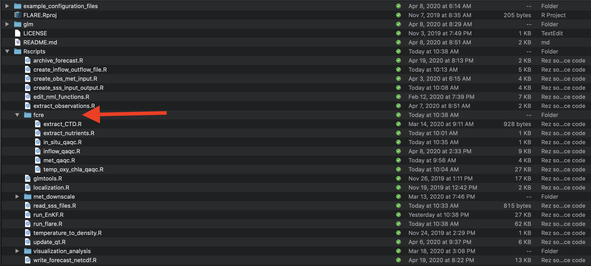

```{r setup, include=FALSE}
knitr::opts_chunk$set(echo = TRUE)
library(tidyverse)
library(ncdf4)
library(lubridate)
```

## Requirements
* [RStudio](https://rstudio.com/products/rstudio/download/)
* R packages
  * Tidyverse
    * uses tidyr version 1.0.0 or higher (uses `pivot_longer` and `pivot_wider`)
  * mvtnorm
  * ncdf4
  * testit
  * imputeTS
  * tools
  * rMR

## 1: Set up

To set up the files needed for FLARE perform either Step 1a or Step 1b

* Step 1a is the quickest way to get FLARE set-up but won't have the most 
  recent data or code.
* Step 1b is required if you want to automatically pull new data from GitHub

### 1a: Pre-packaged code and data

Download and unzip the file here:

https://www.dropbox.com/s/za4n1h0t5559u8v/flare_users_guide_files.zip?dl=0

### 1b: Generating directories, downloading code, and downloading data manually 

**Download FLARE code**

* Open R Studio

* Locate the terminal tab

{width=75%}

* In the terminal, create the location on your computer where you want to save 
  files for the tutorial using the command `mkdir`. For example:

  `mkdir /Users/quinn/Dropbox/Research/SSC_forecasting/flare_training`   
  
  This will be called your tutorial directory below
  
* In the terminal, move to the new directory using the command `cd`. For example:

  `cd /Users/quinn/Dropbox/Research/SSC_forecasting/flare_training` 

* In the terminal tab run the following command to download the FLARE code from
  Github
  
  `git clone https://github.com/CareyLabVT/FLARE.git`
  
  After the cloning process finishes, you should see a new folder named `FLARE` in your working directory
  
**Download data**

* Create a new directory for data used by FLARE in the tutorial directory.
  First, change your current directory to the tutorial directory using `cd` 
  from the terminal tab (if you just ran the step above, you should already 
  be in this directory). For example:
  
  `cd /Users/quinn/Dropbox/Research/SSC_forecasting/flare_training`

* Then, run the following line to create the directory:
  
  `mkdir SCC_data`

* Change your directory to this new data directory using `cd`

  `cd SCC_data`

* Download the met station data by running the following command in the terminal (this may take a while)

  `git clone -b carina-data --single-branch https://github.com/CareyLabVT/SCCData.git carina-data`
  
* Download the NOAA forecasts for FCR by running the following command in the terminal

  `git clone -b fcre --single-branch https://github.com/CareyLabVT/noaa_gefs_forecasts.git fcre`

* Download the catwalk data by running the following command in the terminal

  `git clone -b mia-data --single-branch https://github.com/CareyLabVT/SCCData.git mia-data`

* Download the weir data by running the following command in the terminal

  `git clone -b diana-data --single-branch https://github.com/CareyLabVT/SCCData.git diana-data`
  
* Download noaa forecasts by running the following command in the terminal

  `git clone -b fcre --single-branch https://github.com/CareyLabVT/noaa_gefs_forecasts.git fcre`

* Download non-sensor data by running the following command in the terminal

  `git clone -b manual-data --single-branch https://github.com/CareyLabVT/SCCData.git manual-data`

  The non-sensor data include
    * CTD data from EDI
    * SSS files
    * Nutrient chemistry from EDI
    * Weir data from EDI
    
* Download the met station from EDI (this file is too big for Github so you
  have to get it directory from EDI)
  
  * If you would like to do this manually, the file can be found at:
  https://portal.edirepository.org/nis/mapbrowse?packageid=edi.389.4.
  Download the file `Met_final_2015_2019.csv` and move it to your `SCC_data/manual-data`
  directory
  
  * Alternatively you can use R to download from EDI using the following command
  
```{r eval = FALSE}
download.file("https://portal.edirepository.org/nis/dataviewer?packageid=edi.389.4&entityid=c1db8816742823eba86696b29f106d0f",
              destfile = "SCC_data/Met_final_2015_2019.csv")
```

**Create directory for running FLARE**

* Create a directory in your working directory (`flare_training`, not the SCC_data directory) 
using `mkdir`. For example:

  `mkdir /Users/quinn/Dropbox/Research/SSC_forecasting/flare_training/flare_simulation`

 Copy the following files from `FLARE/example_configuration_files` to 
`flare_simulation`

 * `initiate_forecast_example.R`
 * `glm3_woAED.nml`
 * `configure_FLARE.R`
 
## 2: Configure simulation (GLM)

A FLARE simulation with AED requires three files that should be in your 
`flare_simulation` directory (coppied to this location in the step above). 
The configuration funcations are spread across the files. These
files are described in more detail below

 * `initiate_forecast_example.R`
 * `glm3_woAED.nml`
 * `configure_FLARE.R`

### initiate_forecast_example.R

This file is the main script that launches the FLARE code and plots the output.
In this tutorial you will modify the following variables (for now only modify the 
first three as specified)

* `data_location`: This is the `SCC_data` directory (full path; you will need to 
change this to reflect the location of your directory)
* `code_folder`: This is the `FLARE` directory (full path; you will need to 
change this to reflect the location of your directory)
* `forecast_location`: This is the `flare_simulation` directory  (full path; 
you will need to change this to reflect the location of your directory)
* `execute_location`: This is the same as `forecast_location` unless you are
  executing the simulation in a different directory. I use this to execute the
  code on a RAM disk to save read-writes to my hard disk. You don't need to do 
  this in the tutorial
* `restart_file`: This is the full path to the file that you want to use as
  initial conditions for the simulation. You will set this to `NA` if the simulation
  is not a continuation of a previous simulation.
* `sim_name`: a string with the name of your simulation. This will appear in your 
  output file names
* `forecast_days`: This is your forecast horizon. The max is `16` days. Set to `0`
  if only doing data assimilation with observed drivers.
* `spin_up_days`: set to zero. Don't worry about this one.
* `start_day_local`: The date that your simulation starts. Uses the YYYY-MM-DD
   format (e.g., "2019-09-20"). `2018-07-12` is the first day in the SCC project (when
   the catwalk temperature data comes online)
* `start_time_local`: The time of day you want to start a forecast. Because GLM
  is a daily timestep model, the simulation will start at this time. It 
  uses `mm:hh:ss` format and must only be a whole hour. It is in the **local time
  zone** of the lake in standard time. It can be any hour if only doing data 
  assimilation with observed drivers (forecast_days = 0). If forecasting 
  (forecast_days > 0) it is required to match up with the availability of a NOAA 
  forecast. NOAA forecasts are available at 
  * 00:00:00 GMT
  * 06:00:00 GMT
  * 12:00:00 GMT
  * 18:00:00 GMT
* `forecast_start_day_local`: The date that you want forecasting to start in 
   your simulation. Uses the YYYY-MM-DD format (e.g., "2019-09-20"). The difference
   between `start_time_local` and `forecast_start_day_local` determines how 
   many days of data assimilation occur using observed drivers before handing 
   off to forecasted drivers and not assimilating data
* `forecast_sss_on`: Only used in AED simulations for setting the SSS (hypolimnetic 
oxygenation system) to on in the forecast

`initiate_forecast_example.R` loads Rscripts and runs the FLARE code with
the EnKF function `run_flare` and the plotting code `plot_forecast`.

### glm3_woAED.nml

`glm3_woAED.nml` is already configured to run only GLM (not GLM-AED) for FCR.

### configure_FLARE.R

`configure_FLARE.R` has the bulk of the configurations for FLARE that you will
set once and reuse (unlike `initiate_forecast_example.R` which changes when
you want to forecast a new time period). The end of this document describes all 
of the configurations in `configure_FLARE.R`. Later in the tutorial, you will
modify key configurations in `configure_FLARE.R`

If you set up your directories and modified the 
`initiate_forecast_example.R` as described above, then you will not need to 
modify `configure_FLARE.R` to do a test simulation.

## 3: Run your first simulation (GLM)

To run your first FLARE simulation confirm that the following variables are set 
in your `initiate_forecast_example.R` file:

* `restart_file <- NA`
* `sim_name <- "test"`
* `forecast_days <- 16`
* `start_day_local <- "2018-07-12"`  
* `start_time_local <- "07:00:00"`
* `forecast_start_day_local <- "2018-07-15"`

Now source `initiate_forecast_example.R`.

{width=75%}

You will find that a `working_directory` directory is created in your 
`flare_simulation` directory. This is were all the files for the simulation are 
stored. After the simulation is finished all the important files are moved to 
the `flare_simulation` directory so it is fine to delete the `working_directory`.

Your console will show a lot of messages from R that are mostly associated with
reading and writing files. You will know that you simulation has started to 
work when you see the timestep being printed out to the console. This step will 
take a while.

{width=50%}

Once the simulation is complete you will find a PDF and a netcdf (.nc) file in 
`flare_simulation` directory. The PDF is the plotted output and the netcdf file
is the FLARE output.

## 4: Examining FLARE output

First, you can view the PDF that is output automatically. The PDF includes
the mean and 95% CI for all depths simulated. The observations are added if 
they are available. If parameters are fit in the EnKF, they are also shown.

### Example of FLARE output

Second, the netcdf output FLARE can be analyzed. Netcdf files are binary so 
you can not open them without special software. R has useful functions for 
working with netcdf files. For example, this is how you would analyze the mean
temperature output from FLARE. 

```{r}
nc_file <- "example_output/test_H_2018_07_12_2018_07_15_F_16_4302020_15_13.nc"
nc <- nc_open(nc_file)
```

The data is stored as follows

```{r}
print(nc)
```

The key to understanding the file is the dimensions. For the variable 
`temp_mean` the first dimension is `time` and the second is `z`, which is depth.
The actual values for these dimensions are in the variables with in the 
dimensions called `time` and `z`. The other key dimension is `ens`, which is
the ensemble member. It is not present in `temp_mean` because that output 
variable is summarized across ensemble members.

### Plotting FLARE output

To visualize the output, you can use the following code

```{r out.width = '50%'}
temp_mean <- ncvar_get(nc, varid = "temp_mean") #get the mean temperatures from the netcdf file
t <- ncvar_get(nc, varid = "time") #get the corresponding times from the netcdf file
t <- as.POSIXct(t, origin = '1970-01-01 00:00.00 UTC', tz = "EST") #format times as datetime

depth_index <- 3 #What depth are you interested in?
d <- tibble(time = t, #create a dataframe of times and temperatures at the specified depth
            temp_mean = temp_mean[,depth_index])

ggplot(d, aes(x = time, y = temp_mean)) + #plot mean temperature (modeled) at this depth over time
  geom_line() +
  geom_point() +
  labs(x = "Date", y = expression(~degree~C), title = "FCR forecast")
```

However, you do not know which points were based on observed drivers and data
assimilation and which points were forecasted. To find the points that are 
forecasted you need the `forecasted` variable in the output.

```{r out.width = '50%'}
forecasted <- ncvar_get(nc, varid = "forecasted") #binary. 1: forecasted, 0: not forecasted
depth_index <- 3
d <- tibble(time = t, 
            temp_mean = temp_mean[,depth_index],
            forecasted = as.logical(forecasted))

ggplot(d) +
  geom_line(aes(x = time, y = temp_mean, color = forecasted)) +
  geom_point(aes(x = time, y = temp_mean, color = forecasted))  +
  labs(x = "Date", y = expression(~degree~C), title = "FCR forecast")
```

You can add the uncertainty using the following.

```{r  out.width = '50%'}
temp_mean <- ncvar_get(nc, varid = "temp_mean")
temp_upper95 <- ncvar_get(nc, varid = "temp_upperCI")
temp_lower95 <- ncvar_get(nc, varid = "temp_lowerCI")
forecasted <- ncvar_get(nc, varid = "forecasted")
t <- ncvar_get(nc, varid = "time")
t <- as.POSIXct(t, origin = '1970-01-01 00:00.00 UTC', tz = "EST")

depth_index <- 4
d <- tibble(time = t,
            temp_mean = temp_mean[,depth_index],
            temp_upper95 = temp_upper95[,depth_index],
            temp_lower95 = temp_lower95[,depth_index],
            forecasted = as.logical(forecasted))

ggplot(d,aes(x = time)) +
  geom_line(aes(y = temp_mean)) +
  geom_ribbon(aes(ymin = temp_lower95, ymax = temp_upper95), alpha = 0.25) +
  geom_vline(xintercept = last(d$time[which(d$forecasted == 0)])) + #vertical line marking the day of the forecast
  labs(x = "Date", y = expression(~degree~C), title = "FCR forecast")
```

You can add observations

```{r  out.width = '50%'}
temp_mean <- ncvar_get(nc, varid = "temp_mean")
temp_upper95 <- ncvar_get(nc, varid = "temp_upperCI")
temp_lower95 <- ncvar_get(nc, varid = "temp_lowerCI")
forecasted <- ncvar_get(nc, varid = "forecasted")
t <- ncvar_get(nc, varid = "time")
t <- as.POSIXct(t, origin = '1970-01-01 00:00.00 UTC', tz = "EST")
obs <- ncvar_get(nc, varid = "obs")

depth_index <- 4
d <- tibble(time = t,
            temp_mean = temp_mean[,depth_index],
            temp_upper95 = temp_upper95[,depth_index],
            temp_lower95 = temp_lower95[,depth_index],
            forecasted = as.logical(forecasted),
            obs = obs[, depth_index])

ggplot(d,aes(x = time)) +
  geom_line(aes(y = temp_mean)) +
  geom_ribbon(aes(ymin = temp_lower95, ymax = temp_upper95), alpha = 0.25) +
  geom_point(aes(y = obs), color = "red") +
  geom_vline(xintercept = last(d$time[which(d$forecasted == 0)])) +
  labs(x = "Date", y = expression(~degree~C), title = "FCR forecast")
```

Finally, you can calculate the statistics of the forecast directly from the 
ensembles (rather than using the statistics already calculated in the netcdf file; 
these should be identical for mean and 95% confidence intervals)

```{r}
temp <- ncvar_get(nc, varid = "temp")
forecasted <- ncvar_get(nc, varid = "forecasted")
t <- ncvar_get(nc, varid = "time")
t <- as.POSIXct(t, origin = '1970-01-01 00:00.00 UTC', tz = "EST")
obs <- ncvar_get(nc, varid = "obs")

depth_index <- 4

temp_lower95 <- rep(NA, length(t))
temp_upper95 <- rep(NA, length(t))
temp_mean <- rep(NA, length(t))
for(i in 1:length(t)){
  temp_lower95[i] <- quantile(temp[i, , depth_index],0.025) #calculate the 95% confidence interval from all ensemble members at each date
  temp_upper95[i] <- quantile(temp[i, , depth_index],0.975)
  temp_mean[i] <- mean(temp[i, , depth_index]) #calculate the mean of all ensemble members at each date
}

d <- tibble(time = t,
            temp_mean = temp_mean,
            temp_upper95 = temp_upper95,
            temp_lower95 = temp_lower95,
            forecasted = as.logical(forecasted),
            obs = obs[, depth_index])

d
```

## 5: Running GLM-AED

To run GLM-AED fist copy a glm namelist file to your simulation `flare_simulation` 
directory. Thre are two example options in the 
`FLARE/example_configuration_files` directory. They differ in whether they 
include an additional inflow and outflow that represents the SSS (bottom-water oxygenation system).

* `glm3_wAED_wSSS.nml`: Include the SSS inflows and outflows
* `glm3_wAED_woSSS.nml`: Excludes the SSS inflows and outflows

Second, copy an aed namelist file to your simulation `flare_simulation` 
directory. Thre are two example options in the 
`FLARE/example_configuration_files` directory. They differ in whether they 
include all the water quality variables in AED or only oxygen.

* `aed2.nml`: All variables
* `aed2_only_Oxy.nml`: Only oxygen

Third, modify the following in `configure_FLARE.R`:

* `include_wq`: Set to `TRUE`
* `base_GLM_nml`: full path to the glm namelist matches the one in your 
`flare_simulation` that includes AED.
* `base_AED_nml`: full path to your aed namelist
* `base_AED_phyto_pars_nml`: full path to your phyto_pars namelist
* `base_AED_zoop_pars_nml`: full path to your zoop_pars namelist

Finally, confirm that the following varibles in `configure_FALRE.R` match your desire
use of the data:

* `do_methods`: these are the names of the different measurement methods as 
  defined in the temp_oxy_chla_qaqc.R and extract_CTD.R scripts
    * current values for FCR: `exo`, `do`, `ctd`
* `chla_methods`: these are the names of the different measurement methods as 
  defined in the temp_oxy_chla_qaqc.R and extract_CTD.R scripts
    * current values for FCR: `exo`, `ctd`
* `fdom_methods`: these are the names of the different measurement methods as 
  defined in the temp_oxy_chla_qaqc.R and extract_nutrients.R scripts
    * current values for FCR: `exo`, `grap_sample`
* `nh4_methods`: these are the names of the different measurement methods as 
  defined in the extract_nutrients.R
    * current values for FCR: `grap_sample`
* `no3_methods`: these are the names of the different measurement methods as 
  defined in the extract_nutrients.R
   * current values for FCR: `grap_sample`
* `srp_methods`: these are the names of the different measurement methods as 
  defined in the extract_nutrients.R
* `time_threshold_seconds_oxygen`: this is the number of seconds that an observation
  has to be within the `start_time_local` to be used in the analysis
* `time_threshold_seconds_chla`: this is the number of seconds that an observation
  has to be within the `start_time_local` to be used in the analysis
* `time_threshold_seconds_fdom`: this is the number of seconds that an observation
  has to be within the `start_time_local` to be used in the analysis
* `time_threshold_seconds_nh4`: this is the number of seconds that an observation
  has to be within the `start_time_local` to be used in the analysis
* `time_threshold_seconds_no3`: this is the number of seconds that an observation
  has to be within the `start_time_local` to be used in the analysis
* `time_threshold_seconds_srp`: this is the number of seconds that an observation
  has to be within the `start_time_local` to be used in the analysis

## 6: Modifying FLARE

### Turning off data assimilation

* Our for modification to FLARE will be remove a source of uncertainty in the 
  forecast
  The `uncert_mode` allows you to do this easily based on the following:
  * 1 = all types
  * 2 = no uncertainty
  * 3 = only process uncertainty
  * 4 = only NOAA weather forecast uncertainty
  * 5 = only initial condition uncertainty
  * 6 = only initial condition uncertainty and no state updating  with EnKF
  * 7 = only parameter uncertainty
  * 8 = only meteorology downscaling uncertainty
  * 9 = no sources of uncertainty and no state updating with EnKF
  * 11 = all sources of uncertainty and no state updating with EnKF
  
In this tutorial, explore how data assimilation influences your forecast. To do 
this modify the following two variables and source the code:

* `uncert_mode <- 11` (in `configure_FLARE.R`)
* `sim_name <- "NO_DA"` (in `initiate_forecast_example.R`)
* source `initiate_forecast_example.R`
  
### Removing parameter estimation

You can remove the parameter optimization so that FLARE only uses data 
assimilation to update the initial conditions of a forecast.
  * In `configure_FLARE.R` add the following code to line 250. These remove
  the parameters from EnKF.
  
```{r}
par_names <<- c()
par_names_save <<- c()
par_nml <<- c()
par_init_mean <<- c()
par_init_lowerbound <<- c()
par_init_upperbound <<- c()
par_lowerbound <<- c()
par_upperbound <<- c()
par_init_qt <<- c()
par_units <<- c()
```

### Increasing observational uncertainty

The second modification you will do is to to increase the observational 
uncertainty. In `configure_FLARE.R` set `obs_error_temperature_intercept = 1`.
Then Source `initiate_forecast_example.R`. Importantly, observational 
uncertainty is in variance units (the square of standard deviation).

Observational uncertainty has two components.

* `obs_error_temperature_intercept`: the component that is independent of the 
  measurement magnitude
* `obs_error_temperature_slope`: the component that linearly scales with 
the magnitude of the measurement

### Changing the ensemble size

The variable `ensemble_size` allows you to adjust the size of the ensemble. You
can use any value if you are using data assimilation with observed drivers. If 
you are forecasting then `ensemble_size` must be a multiple of `21*n_ds_members`,
where 21 is the number of NOAA GEF ensemble members.

### Changing the number of depths simulated

The variable `modeled_depths` allows you to adjust the depths that FLARE 
simulates

## 7: Modifying FLARE for a new lake

We are in the process of making it easier to apply FLARE to a new lake. Currently
applying FLARE to a new lake requires modifying R scripts because data 
streams (meteorology, inflow, and in situ data) formats differ between
lakes. The following steps are required to set up a new lake:

### Modify the glm namelist

Within the glm namelist (`glm3_woAED.nml` in the tutorial), at minimum you need to change
the variables in the `&morphometry`, `&inflow`, and `&outflow` sections. Please
see the [GLM users guide](https://aed.see.uwa.edu.au/research/models/GLM/index.html) for 
more information about the variables in these sections of the namelist. 

You will also need to modify the `zone_heights` in the
`&sediment` section for your new lake. Currently, FLARE only handles two 
`zone_heights`, where the first value is the top depth of the bottom layer and 
the second value is the top of the top layer (the maximum depth of the lake).

Other variables to modify are:

* `Kw`: the light extension coefficient

The FLARE code automatically updates all the variables in `&init_profiles`

### Modify Configure_flare.R

Within `configure_flare.R` you will need to update:

* `lake_name`: this is the code for the lake. It must match the the lake
specific directory within your `/FLARE/Rscripts/[lake_name]` directory.
* `lake_latitude`: Degrees North
* `lake_longitude`: Degrees West
* `local_tzone` : Standard time, a time zone that R understands
* `lake_depth_init`: Initial depth of the lake
* `modeled_depths`: depths that are simulated
  
You will also need to update the file names for the driver and in situ data: 

* `insitu_obs_fname`: the in situ data (temperature, do, etc)
* `met_obs_fname`: the meteorological station
* `inflow_file1`: the first inflow (the weir at FCR)
* `inflow_file2`: an optional second inflow
* `outflow_file1`: an optional outflow (NOTE: this currently is not used in FLARE)

FLARE also allows you to include a separate file for CTD depth profiles:

* `ctd_fname`: a value of NA is needed if you do not have or do not want to use
CTD measurements

Importantly, `insitu_obs_fname`, `met_obs_fname`, and `inflow_file1` **require** two 
file names. The first is the realtime file that has not had QAQC applied (i.e,
just downloaded from the sensor). The second is file that has QAQC applied (i.e,
a file from a data repository). If any time periods overlap between the two
files, FLARE will default the second (QAQCed) file. Historical data assimilation
applications will use the QAQCed file. If you are missing one of the two file,
the vector should have an `NA` in its place.

You will need to specify how to process data files:

* `temp_methods`: these are the names of the different measurement methods used to 
aquire data (e.g. CTD profile, in situ thermistor), as defined in the 
temp_oxy_chla_qaqc.R and, potentially, extract_CTD.R, scripts that 
you have modified for the new lake. 
    * current values for FCR: `thermistor`, `exo`, `do`, `ctd`
* `time_threshold_seconds_temp`: this is how close a measurement needs to be to the 
forecast time (`start_time_local`) to be used in the analysis, in seconds.
* `distance_threshold_meter`: this is the distances in meters that an observation
 has to be within to be matched to a value in `modeled_depths`.

Finally there are some plotting configurations:

* `focal_depths_manager`:  the depths that are included in the plot with the
  % chance of turnover
* `turnover_index_1`: the top depth used in the calculation of whether the lake 
  is mixed
* `turnover_index_2`: the bottom depth used in the calculation of whether the lake 
  is mixed 
  
### Creating and modifying a lake-specific Rscripts directory

You need to create a `/FLARE/Rscripts/[lake_name]` directory and move all the
files in `/FLARE/Rscripts/fcre` to that directory.

{width=75%}

You may need to modify the following files that you moved to 
`/FLARE/Rscripts/[lake_name]`, depending on how similar your data file formats 
are to the files used at fcre.

* `met_qaqc.R`:
  * Inputs:
    * `fname`
    * `cleaned_met_file`
    * `input_file_tz`
    * `local_tzone`
    * `full_time_local`
  * Outputs: needs to write a csv file with the following columns
    * timestamp
    * ShortWave
    * LongWave
    * AirTemp 
    * RelHum
    * WindSpeed
    * Rain
* `inflow_qaqc.R`:
  * Inputs:
    * `realtime_file`
    * `qaqc_file` 
    * `nutrients_file`
    * `cleaned_inflow_file` 
    * `local_tzone`
    * `input_file_tz`
  * Output: needs to write a csv file with the following columns
    * GLM only: time, FLOW, TEMP, SALT
    * GLM AED: variables defined in `wq_names` (`configure_FLARE.R`)
* `in_situ_qaqc.R`: This function calls the following functions that need to be
  modified based on the format of the lake data streams
  * Inputs: 
    * `insitu_obs_fname`
    * `data_location`
    * `maintenance_file`
    * `ctd_fname`
    * `nutrients_fname`
    * `cleaned_observations_file_long`
    * `lake_name`
    * `code_folder`
  * Outputs: needs to write a csv file with the following columns
    * timestamp: date-time class
    * depth: meters
    * variable: measurement variable
    * method: user defined string defining the type of measurement. Matches
        methods in `configure_FLARE.R` (i.e., `temp_methods`)
  * `in_situ_qaqc.R` calls the following functions
    * `temp_oxy_chla_qaqc.R`:
      * Inputs:
        * `realtime_file`
        * `qaqc_file`
        * `maintenance_file`
        * `input_file_tz`
      * Output: data frame with the following columns
          * timestamp: date-time class
          * depth: meters
          * variable: measurement variable
          * method: user defined string defining the type of measurement. Matches
        methods in `configure_FLARE.R` (i.e., `temp_methods`)
    * `extract_CTD.R`:
      * Inputs:
        * `fname`
        * `input_file_tz`
        * `local_tzone`
      * Output: data frame with the following columns
        * timestamp: date-time class
        * depth: meters
        * variable: measurement variable
        * method: user defined string defining the type of measurement. Matches
        methods in `configure_FLARE.R` (i.e., `temp_methods`)  
    * `extract_nutrients.R`:
      * Inputs:
        * `fname`
        * `input_file_tz`
        * `local_tzone`
      * Output: data frame with the following columns
        * timestamp: date-time class
        * depth: meters
        * variable: measurement variable
        * method: user defined string defining the type of measurement. Matches
        methods in `configure_FLARE.R` (i.e., `temp_methods`)

## Appendix:  FLARE Configurations

A guide to the variables in `configure_flare.R`

### General set-up
*  `GLMversion`: string of GLM version
*  `FLAREversion`: string of FLARE version
* `use_null_model`: Whether to use the persistance null model or GLM
  * `TRUE`: use persistance null model
  * `FALSE`: use GLM
* `include_wq`: Whether to use GLM-AED or just GLM
  * `TRUE`: use GLM-AED
  * `FALSE`: only use GLM
* `uncert_mode`: code for the type of uncertainty to include in simulation
  * 1 = all types of uncertainty
  * 2 = no uncertainty
  * 3 = only process uncertainty
  * 4 = only NOAA weather forecast uncertainty
  * 5 = only initial condition uncertainty
  * 6 = only initial condition uncertainty and no state updating with the EnKF
  * 7 = only parameter uncertainty
  * 8 = only meteorology downscaling uncertainty
  * 9 = no sources of uncertainty and no state updating with EnKF
  * 11 = all sources of uncertainty and no state updating with EnKF
* `single_run`: Removes uncertainty and only simulates 3 ensemble members
  * `TRUE`:: only simulates 3 ensemble members without uncertainty
  * `FALSE`: all ensemble members and uncertainty specified in `uncert_mode`
* `pull_from_git`: Flag to pull data from GitHub
  * `TRUE`: Pull
  * `FALSE`: Don't pull (needed if you are offline)
* `push_to_git`: Push results to GitHub
  * `TRUE`: Push
  * `FALSE`: Don't Push (needed if you are offline)

### Lake specific variables

* `lake_name`: four letter code name for lake. Match lake directy in 
   `FLARE/Rscripts` and in the NOAA GEF files
* `lake_latitude`: Degrees North
* `lake_longitude`: Degrees West
* `local_tzone`: In standard time. Must be recognized by R.

### Weather forcing options
* `use_future_met`
  * `TRUE`: use NOAA forecast for "Future"
  * `FALSE` = use observed weather for "Future"; only works if "forecasting" past dates
* `DOWNSCALE_MET`: apply spatial and temporal downscaling
  * `TRUE`: downscale
  * `FALSE`: don't downscale
* `noaa_location`: full path of directory with NOAA GEF files
  * paste0(data_location, "/",lake_name,"/")
* `downscaling_coeff`: full path to the Rdata that has previously estimated
  downscaling coefficients
  * paste0(data_location, "/manual-data/debiased.coefficients.2018_07_12_2019_07_11.RData")
  * NA: no previous coefficient, calculate within simulation if 
    `DOWNSCALE_MET == TRUE`.
* `met_ds_obs_start`: Starting date to include in estimation of downscaling 
  coefficients
   * date class (`as.Date("2019-07-11")`)
* `met_ds_obs_end`: Ending date to include in estimation of downscaling 
  coefficients
  * date class (`as.Date("2019-07-11")`)
* `missing_met_data_threshold`: PENDING

### Inflow options

* `use_future_inflow`: Use forecast inflow vs. observed inflow (if available)
  * `TRUE`: Future inflow
  * `FALSE`: Observed inflow
* `future_inflow_flow_coeff`: Vector of three numbers
  * Intercept
  * Coefficient with lagged flow rate
  * Coefficient with lagged rain
* `future_inflow_flow_error`: Standard deviation of future flow model
* `future_inflow_temp_coeff`:
  * Intercept
  * Coefficient with lagged water temperature
  * Coefficient with lagged air temperature
* `future_inflow_temp_error`: Standard deviation of future temperature model

### GLM namelist files

* `base_GLM_nml`: full path to the glm namelist
  * example: paste0(forecast_location,"/glm3_woAED.nml" )
* `base_AED_nml`: full path to the aed namelist
* `base_AED_phyto_pars_nml`: full path to the phyto_pars namelist
* `base_AED_zoop_pars_nml`: full path to the zoop_pars namelist

### Depth information

* `modeled_depths`: Vector of depths are that represented in the EnKF

### Ensemble description

* `ensemble_size`: Total number of ensemble members
* `n_ds_members`: Number of random samples drawn from each NOAA GEF ensemble
  member based on the variance-covariance matrix from downscaling analysis.
* `n_inflow_outflow_members`: Number of random samples drawn from the 

### Process uncertainty adaption

* `use_cov`: Allow for covariance of process uncertainty across depths
  * `TRUE`: Include
  * `FALSE`: Don't include
* `adapt_qt_method`:
    * 0 = no adapt,
    * 1 = variance in residuals
* `num_adapt_days`: Number of days included in generation of the variance-
   covariance matrix of the residuals. The matrix represents process 
   uncertainties.
* `Inflat_pars`: The variance inflation factor applied to the parameter 
   component of the ensemble. Value greater than 1.

### Parameter calibration information

* `par_names`: vector of GLM names of parameter values estimated
* `par_names_save`: vector of names of parameter values estimated  that are desired in 
output and plots
* `par_nml`: vector of nml file names that contains the parameter that is being estimated
* `par_init_mean`: vector of initial mean value for parameters
* `par_init_lowerbound`: vector of lower bound for the initial uniform distribution of 
  the parameters
* `par_init_upperbound`: vector of upper bound for the initial uniform distribution of 
  the parameters
* `par_lowerbound`: vector of lower bounds that a parameter can have
* `par_upperbound`: vector of upper bounds that a parameter can have
* `par_init_qt`: Not used
* `par_units`: Units of parameter for plotting

### Observation information

* `realtime_insitu_location`: full path to the directory with the non-QAQCed 
  in situ data (i.e., thermistor chain)
* `realtime_met_station_location`: full path to the directory with the non-QAQCed 
  met station data
* `manual_data_location`: full path to the directory with the QAQCed 
  datasets
* `realtime_inflow_data_location`: full path to the directory with the 
  non-QAQCed inflow data.

* `ctd_fname`: full path of CTD file
* `nutrients_fname`: full path of nutrients file
* `insitu_obs_fname`: vector of two full paths
  * 1: path of the realtime file (required)
  * 2: path of respository (QAQCed) file (if not used, must have `NA`)
* `variable_obsevation_depths`: Use the depth measurement from the exo sonde (on a buoy; 
constant depth from surface) to convert the depths of a fixed thermistor chain to distance
from surface
  * `TRUE`: convert
  * `FALSE`: don't convert
* `ctd_2_exo_chla`: slope and intercept of linear regression that converts chla
  values from the CTD to values from the exo sonde
* `met_obs_fname`: vector of two full paths
  * 1: path of the realtime file (required)
  * 2: path of respository (QAQCed) file (if not used, must have `NA`)
* `inflow_file1`: vector of two full paths
  * 1: path of the realtime file (required)
  * 2: path of respository (QAQCed) file (if not used, must have `NA`)
* `outflow_file1`: Not current used
* `inflow_file2`: Not current used
* `temp_methods`: these are the names of the different measurement methods as 
  defined in the `temp_oxy_chla_qaqc.R` and `extract_CTD.R` scripts
    * current values for FCR: `thermistor`, `exo`, `do`, `ctd`
* `do_methods`: these are the names of the different measurement methods as 
  defined in the `temp_oxy_chla_qaqc.R` and `extract_CTD.R` scripts
    * current values for FCR: `exo`, `do`, `ctd`
* `chla_methods`: these are the names of the different measurement methods as 
  defined in the `temp_oxy_chla_qaqc.R` and `extract_CTD.R` scripts
    * current values for FCR: `exo`, `ctd`
* `fdom_methods`: these are the names of the different measurement methods as 
  defined in the `temp_oxy_chla_qaqc.R` and `extract_nutrients.R` scripts
    * current values for FCR: `exo`, `grap_sample`
* `nh4_methods`: these are the names of the different measurement methods as 
  defined in the `extract_nutrients.R`
    * current values for FCR: `grap_sample`
* `no3_methods`: these are the names of the different measurement methods as 
  defined in the `extract_nutrients.R`
   * current values for FCR: `grap_sample`
* `srp_methods`: these are the names of the different measurement methods as 
  defined in the `extract_nutrients.R`
* `time_threshold_seconds_temp`: this is how close a measurement needs to be to the 
forecast time (`start_time_local`) to be used in the analysis, in seconds.
* `time_threshold_seconds_oxygen`: this is how close a measurement needs to be to the 
forecast time (`start_time_local`) to be used in the analysis, in seconds.
* `time_threshold_seconds_chla`: this is how close a measurement needs to be to the 
forecast time (`start_time_local`) to be used in the analysis, in seconds.
* `time_threshold_seconds_fdom`: this is how close a measurement needs to be to the 
forecast time (`start_time_local`) to be used in the analysis, in seconds.
* `time_threshold_seconds_nh4`: this is how close a measurement needs to be to the 
forecast time (`start_time_local`) to be used in the analysis, in seconds.
* `time_threshold_seconds_no3`: this is how close a measurement needs to be to the 
forecast time (`start_time_local`) to be used in the analysis, in seconds.
* `time_threshold_seconds_srp`: this is how close a measurement needs to be to the 
forecast time (`start_time_local`) to be used in the analysis, in seconds.
* `distance_threshold_meter`: this is the distances in meters that an observation
  has to be within to be matched to a value in `modeled_depths`.


### Initial Conditions (GLM)

* `lake_depth_init`: initial lake depth (meters)
* `default_temp_init`: vector of initial temperature profile
* `default_temp_init_depths`: vector of depths in initial temperature profile
* `the_sals_init`: vector of initial salinty values
* `default_snow_thickness_init`: initial snow thickness (cm)
* `default_white_ice_thickness_init`:  initial white ice thickness (cm)
* `default_blue_ice_thickness_init`: initial blue ice thickness (cm)

### Water quality variable information

* `tchla_components_vars`: The names of the phytoplankton groups that contribute to
total chl-a in GLM
* `wq_names`: GLM names of the water quality variables modeled. Not used if include_wq == FALSE
* `biomass_to_chla`: Carbon to chlorophyll ratio (mg C/mg chla) for each group in
`tchla_components_vars`.
  * 12 g/ mole of C vs. X g/ mole of chla
* `init_donc`: Initial ratio of DON:DOC
* `init_dopc`: Initial ratio of DOP:DOC
* `init_ponc`: Initial ratio of PON:POC
* `init_popc`: Initial ratio of POP:POC
* `OXY_oxy_init`: Initial concentration (mmol/m3)
* `CAR_pH_init`: Initial concentration (mmol/m3)
* `CAR_dic_init`: Initial concentration (mmol/m3)
* `CAR_ch4_init`: Initial concentration (mmol/m3)
* `SIL_rsi_init`: Initial concentration (mmol/m3)
* `NIT_amm_init`: Initial concentration (mmol/m3)
* `NIT_nit_init`: Initial concentration (mmol/m3)
* `PHS_frp_init`: Initial concentration (mmol/m3)
* `OGM_doc_init`: Initial concentration (mmol/m3)
* `OGM_poc_init`: Initial concentration (mmol/m3)
* `OGM_pon_init`: Initial concentration (mmol/m3)
* `OGM_pop_init`: Initial concentration (mmol/m3)
* `NCS_ss1_init`: Initial concentration (mmol/m3)
* `PHS_frp_ads_init`: Initial concentration (mmol/m3)
* `PHY_TCHLA_init`: Initial concentration (ug/L)
* `init_phyto_proportion`: vector of the initial proportion of total chla that 
  is each phytoplankton group in `tchla_components_vars` represents. Must add
  up to 1.0

### Observation uncertainty

* `obs_error_temperature_intercept`: the component that is independent of the 
  measurement magnitude
* `obs_error_temperature_slope`:  the component that linearly scales with 
the magnitude of the measurement
* `obs_error_wq_intercept_phyto`: Not used 
* `obs_error_wq_slope_phyto`: Not used
* `obs_error_wq_intercept`: the component that is independent of the 
  measurement magnitude. A vector of with the same length as `wq_names`
* `obs_error_wq_slope`: the component that linearly scales with 
the magnitude of the measurement. A vector of with the same length as `wq_names`

### Process uncertainty                         

* `temp_process_error`: variance of process uncertainty
* `OXY_oxy_process_error`: variance of process uncertainty
* `CAR_pH_process_error`: variance of process uncertainty
* `CAR_dic_process_error`: variance of process uncertainty
* `CAR_ch4_process_error`: variance of process uncertainty
* `SIL_rsi_process_error`: variance of process uncertainty
* `NIT_amm_process_error`: variance of process uncertainty
* `NIT_nit_process_error`: variance of process uncertainty
* `PHS_frp_process_error`: variance of process uncertainty
* `OGM_doc_process_error`: variance of process uncertainty
* `OGM_poc_process_error`: variance of process uncertainty
* `OGM_don_process_error`: variance of process uncertainty
* `OGM_pon_process_error`: variance of process uncertainty
* `OGM_dop_process_error`: variance of process uncertainty
* `OGM_pop_process_error`: variance of process uncertainty
* `NCS_ss1_process_error`: variance of process uncertainty
* `PHS_frp_ads_process_error`: variance of process uncertainty
* `PHY_TCHLA_process_error`: variance of process uncertainty
* `PHY_process_error`: variance of process uncertainty

### Initial condition uncertainty  

* `temp_init_error`: variance of initial temperature
* `OXY_oxy_init_error`: variance of initial oxygen
* `CAR_pH_init_error`: variance of initial pH
* `CAR_dic_init_error`: variance of initial DIC
* `CAR_ch4_init_error`: variance of initial CH4
* `SIL_rsi_init_error`: variance of initial Silica
* `NIT_amm_init_error`: variance of initial Ammonium
* `NIT_nit_init_error`: variance of initial Nitrate
* `PHS_frp_init_error`: variance of initial Phosphorus
* `OGM_doc_init_error`: variance of initial DOC
* `OGM_poc_init_error`: variance of initial POC
* `OGM_don_init_error`: variance of initial DON
* `OGM_pon_init_error`: variance of initial PON
* `OGM_dop_init_error`: variance of initial DOP
* `OGM_pop_init_error`: variance of initial POP
* `NCS_ss1_init_error`: variance of initial SS1
* `PHS_frp_ads_init_error`: variance of initial Adsorped Phosphorus 
* `PHY_TCHLA_init_error`: variance of initial Total Chl-a
* `PHY_init_error`: variance of initial Phytoplankton biomass

### Management specific variables

* `simulate_SSS`: include SSS (bottom-water oxygenation) in simulations with observed drivers (i.e., data
  assimilation simulations)
  * `TRUE`: include
  * `FALSE`: don't include
* `forecast_no_SSS`: Include SSS in forecast
  * `TRUE`: include
  * `FALSE`: don't include
* `forecast_SSS_flow`: Flow rate of SSS in forecast (m3/day)
* `forecast_SSS_Oxy`: Oxygen concentration of SSS in forecast (mmol/m3)
* `sss_fname`: full path to the file that has the SSS Flow and oxygen data
* `sss_inflow_factor`: a scalar to multiply FLOW rate of SSS
* `sss_depth`: The depth (meters) of the SSS inflow/outflow

### Plotting related options

* `focal_depths_manager`:  A vector of depths that are included in the plot with the
  % change of turnover. 
* `turnover_index_1`: the top depth used in the calculation of whether the lake 
  is mixed
* `turnover_index_2`: the bottom depth used in the calculation of whether the lake 
  is mixed 